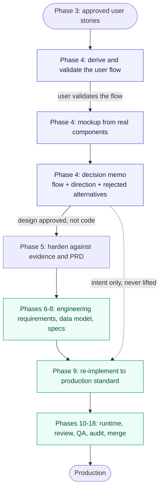

# Design to production

Phase 4 produces a design to approve. Phase 9 produces the product. This document is the contract
between them, because the handover is the point where the two get confused.

## The confusion this prevents

Phase 4's mockup renders through the repository's **real** components — real design-system
package, real tokens, real data shapes. That is deliberate: it is the only way the preview shows
what will actually ship rather than a lookalike.

It also makes the mockup look like production code. So the obvious next move is to lift it, and
that move is wrong.

## What carries forward, and what does not

The design decisions carry forward. The code does not.

| Carries forward as binding intent | Carries no authority |
|---|---|
| The validated user flow — entry points, branches, states, exits | Component structure and file layout |
| Hierarchy, density, and composition | State management and data plumbing |
| Token choices: type roles, spacing, semantic colour | Hard-coded values standing in for tokens |
| Interaction character and motion intent | Event wiring and handler shape |
| Which states exist — empty, error, permission, loading | How those states are produced |

An implementation that honours every row on the left and shares no code with the mockup has done
exactly the right thing.

## No pixel stays a prototype

Everything imported gets built to production standard and hardened like any other code:
frontend through backend architecture, reviewed as code, tested, and put through the same gates
as work that never had a mockup. A design origin buys nothing — not a lighter review, not a
waived test, not an accepted shortcut. Phase 4 approval settles *what to build*; it says nothing
about whether the implementation is good, and Phases 9 through 18 answer that question from
scratch.

The failure this guards against is a prototype shortcut surviving into the product because it
arrived wearing an approved design's authority.

## The journey

The dotted edge is the whole point: the design reaches Phase 9 as intent, and the solid path
through engineering specs is what the implementation is actually built from.

## Where this is enforced

- `commands/feature-pro/phases/04-design.md` — states that the artifact is a design to approve,
  that its component structure carries no authority, and that the decision memo embeds the
  validated flow.
- `commands/feature-pro/phases/09-build.md` — "re-implement it against these specs and this
  repository's conventions, never lift the mockup", in the same instruction that hands Build the
  approved visual inputs.
- Phase 4's exit gate requires the decision memo to be complete before Phase 5, because Phase 5
  reconciles the prototype against the PRD and can only reconcile what was written down.
