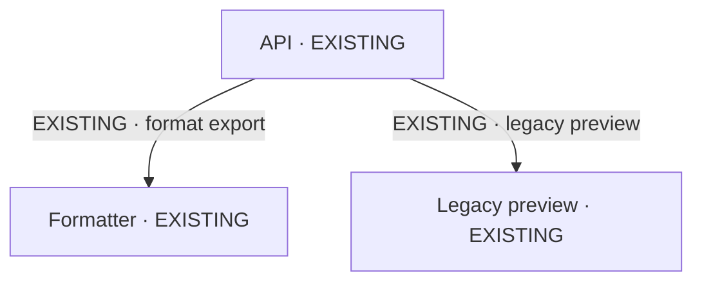
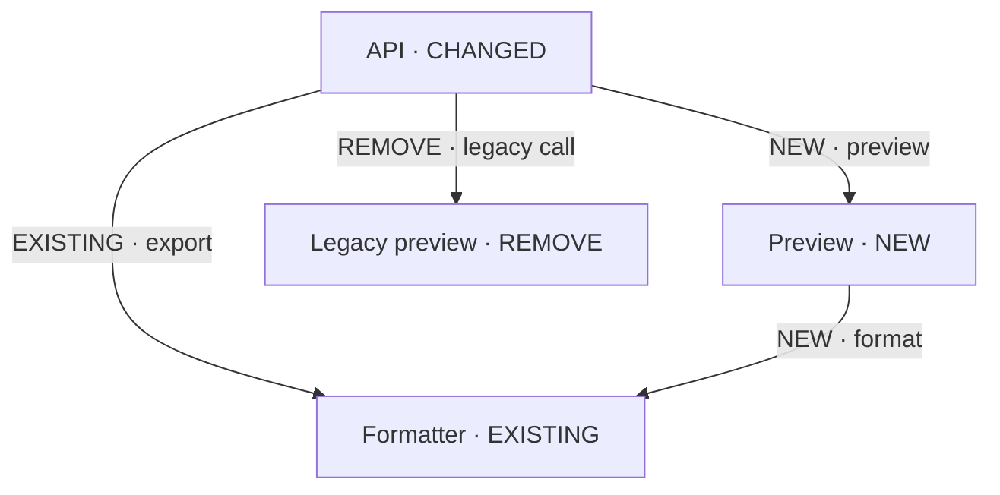
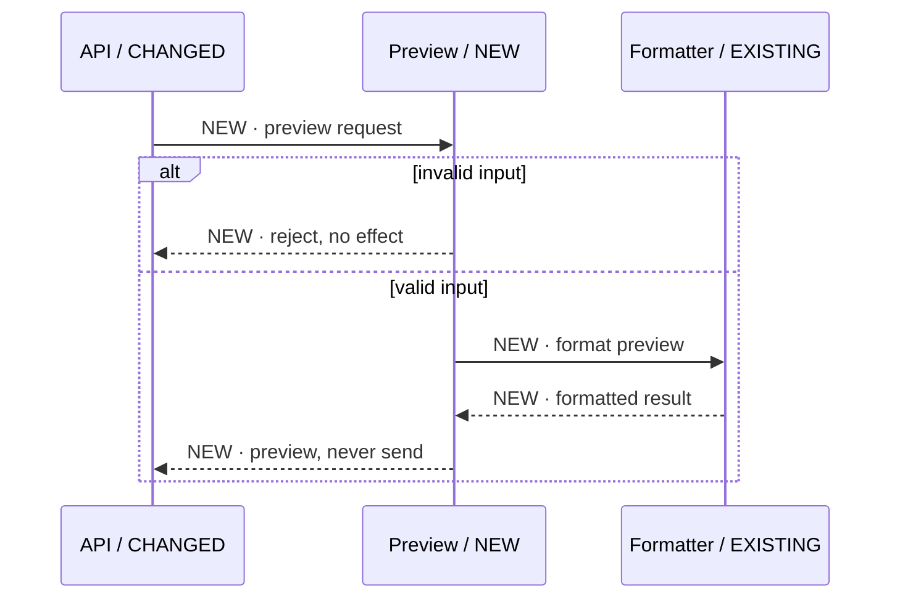

# Add a preview. Keep the proven formatter.

A synthetic architecture example for visual verification—not a proposal for a real repository. The question: can a user preview an invoice without changing the existing export path?

## Read the change, not just the boxes

The formatter already exists. The preview module is proposed. The API gains a route but retains its export behavior. The legacy call is proposed for removal; nothing has been deleted yet. Short NEW, CHANGED and REMOVE tags in diagrams all refer to proposals, as defined by this legend.

| Label | Meaning |
|---|---|
| EXISTING | Present in this synthetic baseline and retained unchanged. |
| NEW / PROPOSED | A proposed addition, not implemented behavior. |
| CHANGED / PROPOSED | Existing identity; the named responsibility or contract would change. |
| REMOVAL / PROPOSED | Present now; proposed removal, not already gone. |

Change status and evidence confidence are separate. All facts below belong to the stated synthetic fixture; an inferred relationship in a real repository would also be labeled INFERRED with its evidence limitation.

## As-built — synthetic baseline

The API invokes the established formatter. A separate legacy preview path is still in service. Arrows name the actual interaction; they do not represent generic association.

## Changes — baseline to proposed option

Read each arrow as well as each box. The export interaction is retained. Preview adds new calls to the existing formatter. The API changes to expose the new route. The legacy path is shown only to explain its proposed removal; it is not active in the target design.

## Proposed sequence — where the invariant holds

This is design intent, not an observed runtime trace. An invalid request receives a rejection. A valid preview reuses the formatter and returns a result; neither branch sends an invoice. The existing export behavior remains a compatibility check before implementation can be accepted.

## What must be agreed before building?

- The formatter's existing export result must remain compatible.
- The new preview is read-only; it must never reach a sending path.
- Removing the legacy route requires checking its callers, not assuming it is unused.
- Source grounding, runtime verification and user approval are separate from a diagram rendering correctly.

This example checks diagram presentation, label preservation, navigation and full-size reading. It does not establish model quality, real-system correctness or user comprehension.
